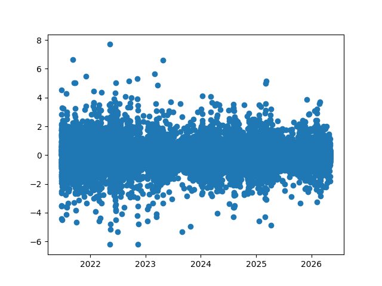
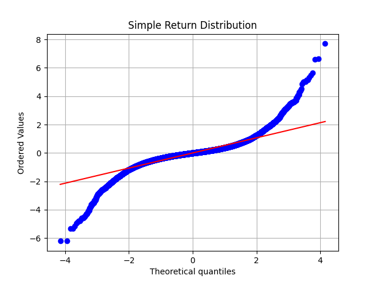
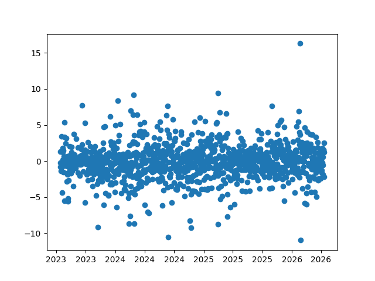
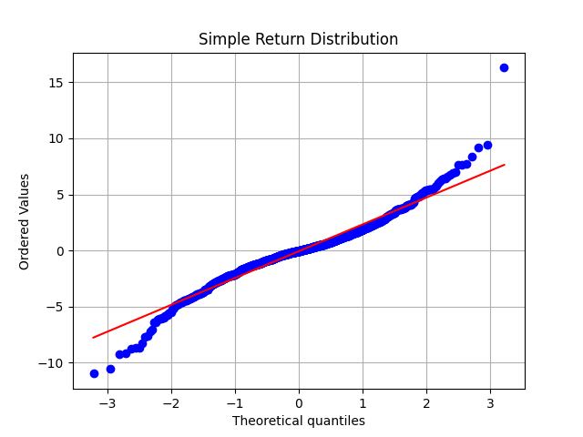
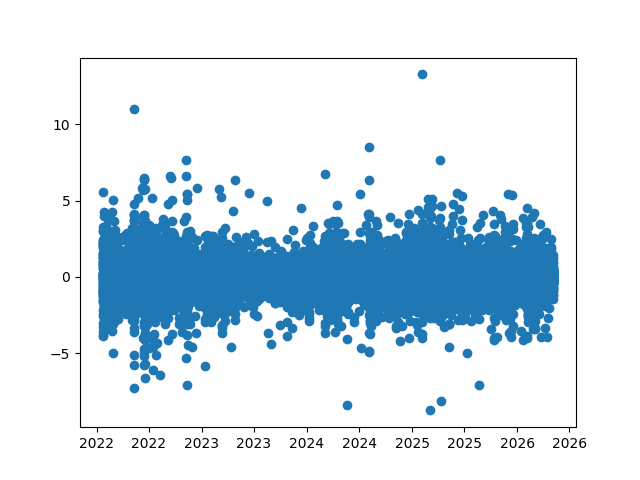
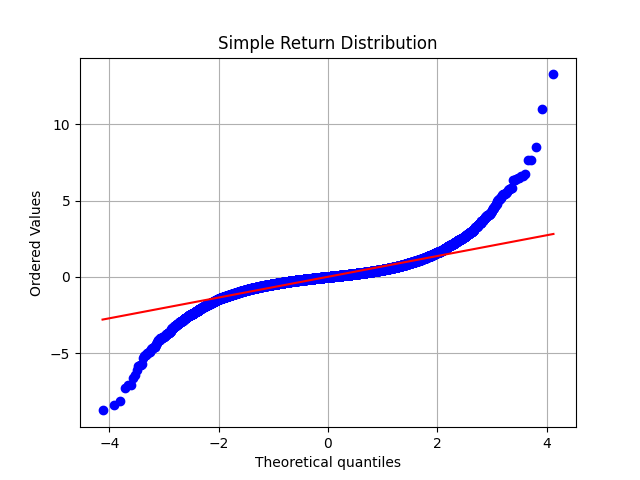
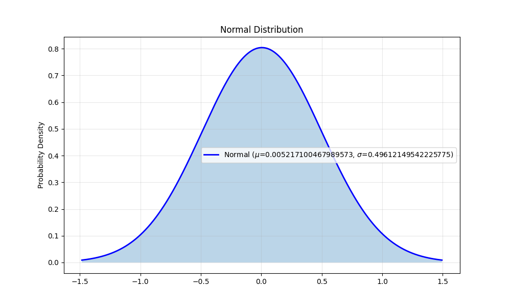

# Probability Density Functions and Cumulative Density Functions: Using Calculus for Insights into Cryptocurrency Markets

## Mathematical and Financial Preliminaries

### Statistical Metrics

These are some common statistical metrics that we will refer to throughout the paper.

Taking $x_n$ as a series of values, with $N$ as the number of values in the series.

The **mean average**, $\mu$ is defined as

$$
\mu=\frac{\sum_{n=1}^{N}{x_n}}{N}
$$

The **standard deviation** of the same given dataset, $\sigma$ is defined as

$$
\sigma=\sqrt{\frac{\sum_{n=1}^{N}{(x_n-\mu)^2}{}}{N}}
$$

### Returns

Because the prices of financial assets are uncertain, we will model them as random variables, making their returns random variables, too. Let $P_0$ and $P_1$ be prices, with $P_1$ being observed after $P_0$ 

The _simple return_ over the time period is

$$
R_s = \frac{P_1-P_0}{P_0} = \frac{P_1}{P_0} - 1
$$

The _log return_ over the time period is

$$
R_l = \ln\left(\frac{P_1}{P_0}\right)
$$

The log return is primarily used due to having a property of additivity. That is, if you have three prices $P_2$, $P_1$, and $P_0$. 

$$
\ln\left(\frac{P_2}{P_0}\right) = \ln\left(\frac{P_1}{P_0}\right) + \ln\left(\frac{P_2}{P_1}\right)
$$

Another property worth considering is their symmetry compared to simple returns. To illustrate this:

$$
\ln(2) + \ln\left(\frac{1}{2}\right) = 0
$$

But with simple returns

$$
x \cdot (1+0.5) \cdot (1 - 0.5) = 0.75x \neq x
$$

Log returns are also a rewrite of $P(t)=P_0e^{kt}$ where $k$ is our log return, modeling growth as a continuous function, which is ideal for the integration techniques we will use when calculating probability.

### Probability Density Functions

To compute the probability of a random variable, such as the prices or returns of our assets, falling within an interval given its history, we'll use _probability density functions_.

$$
P(c \leq X \leq d) = \int_c^df(x)dx
$$

Given that f is continuous or has a finite number of discontinuities, nonnegative, and that $\int_{-\infty}^{\infty}f(x)dx = 1$.

### Normal Distribution

Our dataset naturally satisfies the continuity and non-negativity, but not the last constraint. Because of that, we'll use the **normal distribution**, a.k.a. a bell curve, as our Probability Density Function.

$$
f(x)=\frac{1}{\sigma\sqrt{2\pi}}e^{-(x-\mu)^2/2\sigma^2}
$$

Using a normal distribution has the assumption that the mean of our dataset is its expected value with equal variance in the negative and positive directions.

## Technical Details

### Data

All data is sourced from Gemini in https://www.cryptodatadownload.com:

https://www.cryptodatadownload.com/data/gemini/

In this analysis, we generally look at the prices for BTC and ETH over the last 5 years on a daily and hourly granularity.

## Execution

We can justify using the normal distribution because mainstream cryptocurrencies tend to have equal variance in both directions. Here is a scatter plot of Bitcoin's simple hourly returns from 2021 to 2026, showing this pattern. The y-axis is the percentage of the simple return.

Next we can look at the Q-Q plot for the same dataset. We once again observe the symmetry of the distribution.  Additionally, given the shape of the plot, one well-known feature of cryptocurrency becomes more apparent: cryptocurrency has fat tails, i.e. relatively extreme events are very common.

For a more detailed view, we can look at the same graphs on daily returns from May 2023 to May 2026 and see the same behavior.

We observe similar behavior on Ethereum.

Therefore, we can conclude that a normal distribution is a fair way of modeling the returns of these crypocurrencies' returns as a probability density function. Given that, we can generate a normal distribution graph. This one is from the hourly data from Bitcoin from 2023 to 2026:

This model is consistently inaccurate when put to the test. A few examples:
- the probability of an hourly return between 3% and 15% is, on paper, 0.0000000788%. In reality, it happened 3 times in 2023, 6 times in 2024, 6 times in 2025, and 1 time in 2026 so far as of May 17th 2026
- the probability of a daily return above 8% is 2.346%. It happened 10 times in the same time period

In conclusion, using a probability density function for measuring the probability of cryptocurrency is not an accurate representation of how volatile the behavior of cryptocurrency truly is. Hence, other means of measuring volatility and therefore risk are necessary in order to trade crytocurrencies safely.

In future research, it might be worth exploring other mathematical models of probability, or ways in which a tracer could engage with cryptocurrencies without necessitating a tool to measure risk.

## Sources

Returns: https://gregorygundersen.com/blog/2022/02/06/log-returns/